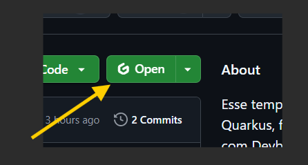

# Pré-requisitos para utilizar esse template sem dor de cabeça
* Sistema Operacional Linux ou WSL 2 (utilizando Windows)

# Objetivo desse template

* Mais produtividade em iniciar projetos Quarkus
* Criar um ambiente de desenvolvimento controlado local ou em nuvem
* Ter a mesma experiência desenvolvimento, local ou em nuvem

# Ambientes

A ideia é montar um ambiente controlado de desenvolvimento para qualquer projeto Quarkus, podemos ter esse ambiente em nuvem com GitPod ou local com DevBox, ambos terá o mesmo ambiente para desenvolver qualquer projeto Quarkus.

## Ambiente em nuvem

Podemos montar o ambiente de desenvolvimento em nuvem com o GitPod, de duas maneiras, via URL ou via extensão do navegador Google Chrome.

#### Via URL:

Para abrir um ambiente de desenvolvimento com o GitPod, é só colocar na frente do endereço do repositório do github o seguinte comando: `gitpod.io/#`, ficando dessa maneira a URL: 

https://gitpod.io/#github.com/leoalmeida99/repositorio-template-quarkus

#### Via extensão:

* Instale a extensão do GitPod:
https://chromewebstore.google.com/detail/dodmmooeoklaejobgleioelladacbeki?utm_source=item-share-cb

* Com a extensão instalada no Chrome, só clicar no atalho do GitPod:


**⚠️ ATENÇÃO:** Importante lembrar que o GitPod é um serviço, porém tem algumas horas grátis de experimento por mês. Recomendo usar apenas em casos específicos (por exemplo mostrar para alguém o projeto funcionando, sem ser localmente). ⚠️

## Ambiente local

Para ter o mesmo ambiente iremos utilizar o Devbox, até o momento, o Devbox roda apenas em Linux, se você já está utilizando Linux, pode pular o "Como utilizar o Devbox no Windows com WSL 2".

### Como utilizar o Devbox no Windows com WSL 2

Primeiro de tudo, detalhes importantes:

* Iremos utilizar a distribuição Linux Ubuntu (que é derivada do Debian).
* Se você quer utilizar outra distribuição, não tem problema, só vai ter que implementar na sua distribuição.
* WSL 2 roda em Windows 10 ou superior e geralmente em Windows 11 já vem pré instalado.

Primeiro de tudo, abra o terminal e verifique se o seu Windows já tem o WSL 2:

```bash
wsl -l -v
```

Se não retornar nada, você precisa instalar o WSL 2. Já existe uma documentação explicando como instalar o WSL 2, 

Link para instalar o WSL 2 no Windows e Devbox:
https://www.jetify.com/docs/devbox/installing_devbox/?install-method=wsl

### Ambiente em Linux


